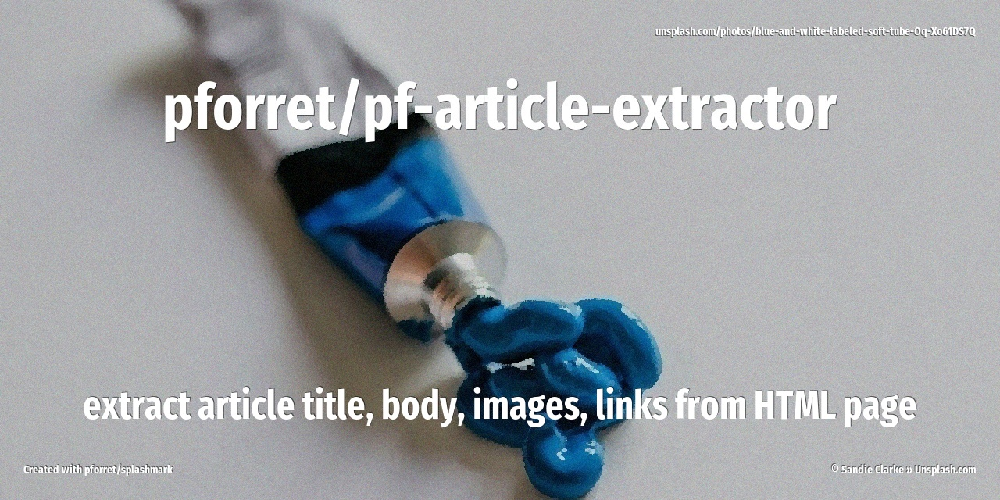

# pforret/pf-article-extractor

[](https://github.com/pforret/pf-article-extractor/actions)

[](https://packagist.org/packages/pforret/pf-article-extractor)
[](https://packagist.org/packages/pforret/pf-article-extractor)


Boilerplate Removal and Fulltext Extraction from HTML pages.
Rewrite of `dotpack/php-boiler-pipe` for ^PHP8.2



## Installation

```bash
composer require pforret/pf-article-extractor
```

## Usage

```php
use Pforret\PfArticleExtractor\ArticleExtractor;

$articleData = ArticleExtractor::getArticle($html);
/*
 * $articleData = Pforret\PfArticleExtractor\Formats\ArticleContents Object
(
    [title] => Film Podcast: Wicked Little Letters Named Film of the Month
    [content] => UK Film Club was back in March with a new episode of their film podcast. (...)
    [date] =>
    [images] => Array
        (
            [0] => https://static.wixstatic.com/media/.../b19cd0_dde0d59546f84127865267f43994f39b~mv2.jpg
        )

    [links] => Array
        (
            [0] => https://www.chrisolson.co.uk/
            (...)
        )

)

 */
```